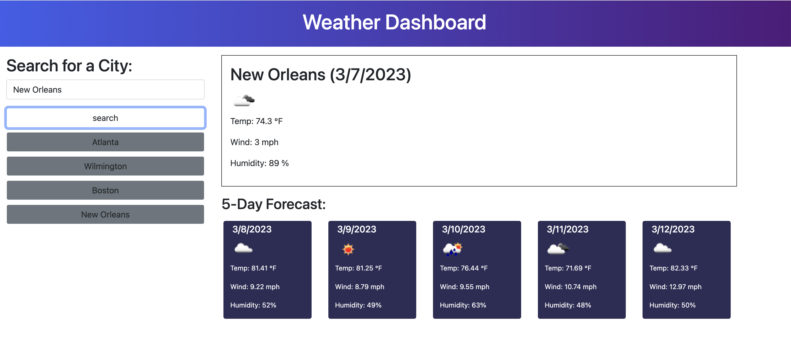

# Weather Dashboard

## Description
This weather dashboard was made to provide the current weather and five day forecast for the city of your choosing. You can enter the city into the search bar and are provided a weather icon that shows the current conditions along with the temperatures, wind, and humidity over a five day period. This site's functionality was built using javascript as well as an openweather API. The actual weather data is being pulled from this API and is based on the cities latitude and longitude coordinates. 

## Installation
N/A

## Usage
This weather dashboard opens with a page that displays the site's title and a search bar to enter the city of your choice. 

Once you enter a city and press search, that current weather and five day forecast for that city will be displayed on your right. Additionaly, that city will be added below the search bar on the left side of the screen. This site tracks the conditions, temperature, wind, and humidity. If you enter an invalid city, an alert will pop up saying "city not found". Below is a picture of the site after searching Wilmington. 

After entering a city, you can search another city in the search bar. Simply clear the search bar and enter the new city. Once you do that and hit search, the new city's weather will display on the screen and that city will also be added below the search bar. If you would like to see an already searched city, you can simply click on one of your previously searched cities and the current weather and five day forecast will display. Below is a picture of the website with several searched cities. 

Below is a link to the active website:

## Credits
https://www.tutorialrepublic.com/faq/how-to-convert-a-unix-timestamp-to-time-in-javascript.php

https://stackoverflow.com/questions/11858458/jquery-alert-onclick-on-elements-child

## License
Please refer to the license in the repo.

